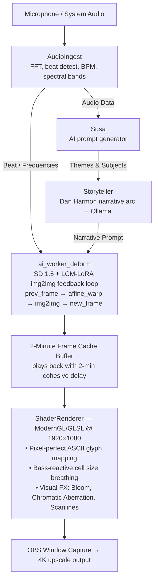
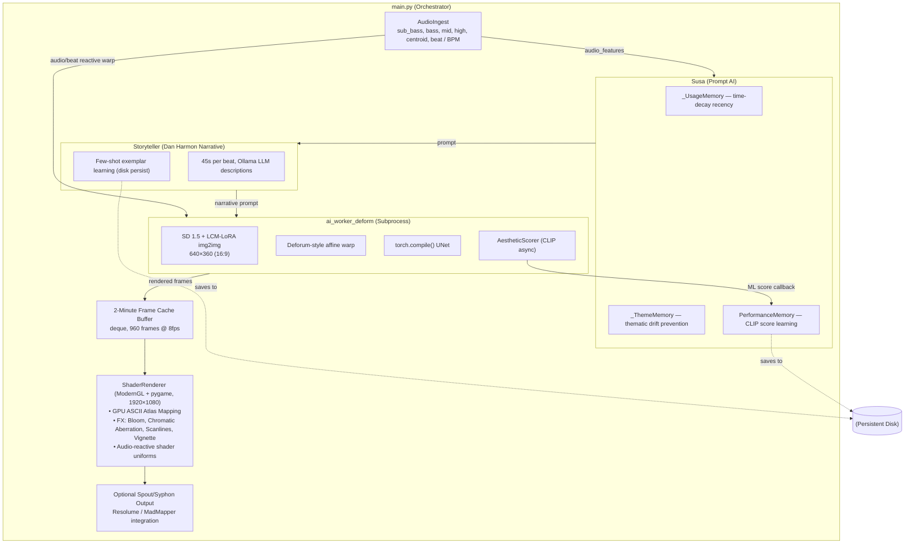

<div align="center">
  
  <h1>VIBES ⚡ V18</h1>
  <p><b>Live AI-Choreographed ASCII Diffusion Engine</b></p>
  
  [](https://www.python.org)
  [](https://pytorch.org/)
  [](https://opensource.org/licenses/MIT)
  
  <p>
    <em>Real-time audio-reactive video diffusion rendered as pixel-perfect colored ASCII glyphs,<br>
    displayed at 1080p and captured by OBS for 4K output. Gets smarter every session.</em>
  </p>
</div>

---

## 🎵 What It Does



---

## 🧠 ML Learning Loop

Every session the system gets smarter:

1. 🎯 **AestheticScorer** — CLIP ViT-B/32 rates each generated frame `[0→1]` asynchronously
2. 💾 **PerformanceMemory** — EMA score tracked per prompt element, saved to `data/performance_memory.json`
3. 🎲 **Susa** — multiplies ML quality weights into token selection probability → high-scoring subjects/styles chosen more
4. 📖 **Storyteller** — high-scoring visual contexts saved per story beat → primes Ollama as few-shot examples next session

*After a few hours of use, the engine self-tunes toward your visual aesthetic.*

---

## 🚀 Quick Start

### 1. Install Dependencies

```bash
cd ollama-vj-engine/python

# Fix torch + install deps
pip uninstall torch torchvision torchaudio -y
pip install torch==2.4.1+cu121 torchvision==0.19.1+cu121 \
  --index-url https://download.pytorch.org/whl/cu121
pip install diffusers==0.37.0 transformers accelerate safetensors \
  xformers opencv-python moderngl pygame pyaudio

# Optional: Ollama for narrative generation
# Install from https://ollama.ai then: ollama pull llama3.2
```

### 2. Run the Engine

```bash
cd ollama-vj-engine/python
python main.py
```

> **Note:** The first run takes ~60s for `torch.compile()` to compile the UNet. Subsequent runs are incredibly fast.

#### Worker Modes:
```bash
python main.py --worker deform     # default: img2img feedback (smooth video)
python main.py --worker optimized  # SD-Turbo txt2img (faster, less coherent)
python main.py --worker video      # SVD video clips (highest quality, slowest)
python main.py --delay 60          # shorter cache delay (default 120s)
```

---

## 🎥 OBS Setup (4K Output)

1. Add **Window Capture** → select `Vibes VJ`
2. Set OBS **Output Resolution**: `3840×2160`
3. Set OBS **Canvas**: `1920×1080` *(let OBS handle the upscale)*
4. Set Source filter: **Lanczos** *(for the sharpest ASCII upscale)*

---

## ⌨️ Hotkeys
*Ensure the Vibes window is focused*

| Key | Effect |
|:---:|:---|
| <kbd>B</kbd> | Toggle **Bloom** glow |
| <kbd>C</kbd> | Toggle **Chromatic aberration** |
| <kbd>L</kbd> | Toggle **Scanlines** |
| <kbd>H</kbd> | Toggle **HUD Overlay** |
| <kbd>F</kbd> | Toggle **Fullscreen** |
| <kbd>Q</kbd> / <kbd>ESC</kbd> | Quit Application |

---

## 🏗️ Architecture

<details>
<summary><b>Click to View Full Architecture Diagram</b></summary>


</details>

---

## 📁 File Structure

```text
python/
├── main.py                  # Orchestrator + 2-min frame buffer
├── ai_worker_deform.py      # ★ img2img feedback loop (DEFAULT)
├── ai_worker_optimized.py   # SD-Turbo txt2img
├── ai_worker_video.py       # SVD video clips
├── audio_ingest.py          # Full spectral audio analysis
├── shader_renderer.py       # ModernGL GLSL renderer + hotkeys
├── susa.py                  # AI prompt generator with ML weights
├── storyteller.py           # Narrative arc + few-shot learning
├── aesthetic_scorer.py      # CLIP async frame scorer
├── performance_memory.py    # Persistent ML quality memory
├── loading_screen.py        # Cinematic 2-min loading screen
└── hud.py                   # On-screen overlay and Spout toggle
data/                        # (Auto-created on first run)
├── performance_memory.json  # Susa's learned quality weights
└── storyteller_memory.json  # Beat exemplars for Ollama
```

---
<div align="center">
  <sub>Built with ⚡ for Live VJ Performances</sub>
</div>
